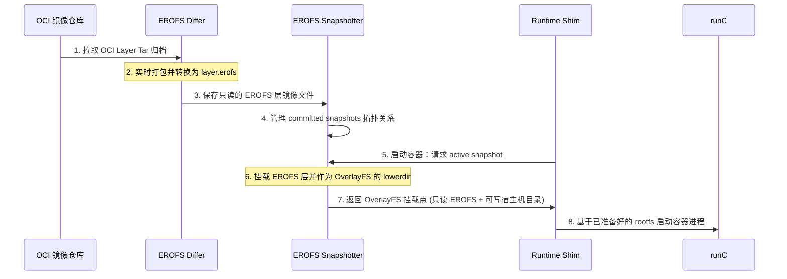
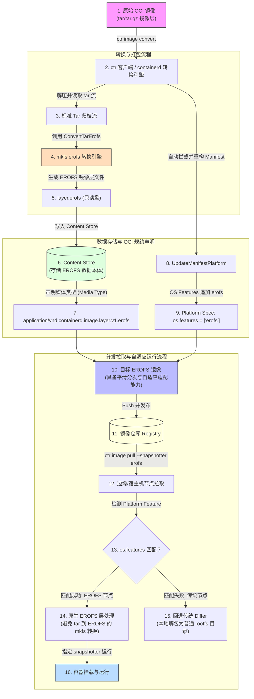
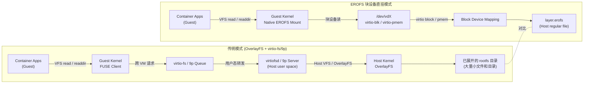

# EROFS 只读文件系统：技术原理与容器化落地实践

本文旨在全面介绍 EROFS 文件系统的核心技术特性、基础操作方法，以及它在普通容器（以 containerd/runC 为核心）与安全容器（以 Kata Containers、Kuasar 为代表）场景中的深度应用实践。

---

## 一、EROFS 的核心特性与基本操作

### 1. 什么是 EROFS？
**EROFS (Enhanced Read-Only File System)** 是一种由 Linux 内核原生支持的、专门为**只读场景**设计的轻量级文件系统。它自 Linux 5.4 版本起被合并入内核主线，最初广泛应用于智能手机分区（如安卓系统分区），随后也逐渐普及至容器镜像、嵌入式设备和机密计算等领域。由于原生去除了写操作支持（如日志记录和复杂的元数据一致性保护机制），EROFS 的磁盘布局极其精简，这也大幅减少了运行时需要暴露的可变状态，非常适合对安全性要求极高的只读分发场景。

EROFS 拥有以下核心技术特性：
- **高度压缩与卓越的读取性能**：支持 LZ4、MicroLZMA 等多种压缩算法。与传统的只读压缩文件系统（如 SquashFS）不同，EROFS 采用独特的**固定输出大小（Fixed-sized output）**压缩算法，能够确保极高的随机读取性能，有效避免了因读取微小数据而不得不解压整块数据的性能损耗。
- **内存共享与直接访问 (FSDAX)**：支持在具备 DAX 能力的设备（如 `virtio-pmem`）上开启 FSDAX 模式。这允许应用程序直接将物理内存映射进用户空间，而无需在 Guest 虚拟机中重复缓存同一份只读 Page Cache，从而大幅度降低了多容器/多虚拟机并发运行时的内存开销。
- **块对齐设计（Block-aligned Design）**：磁盘物理格式天然对齐，完美契合闪存及块设备特性，有效避免了不必要的写放大与额外 I/O 损耗。
- **端到端完整性保护与校验**：支持在文件系统层无缝集成 `fs-verity`，或在底层块设备级配合 `dm-verity`，为只读数据提供极高强度的防篡改与完整性安全校验。
- **文件后端直挂（File-backed Mounts）**：自 Linux 6.12 起，EROFS 支持直接将常规文件挂载为文件系统，而无需创建额外的环回设备（Loop Device），显著简化了挂载流程并节省了系统环回资源。

---

### 2. EROFS 的基本操作示例

#### 2.1 准备工作
确保系统中已安装 `erofs-utils` 工具链（建议版本 1.7 及以上）。
```bash
# For Debian/Ubuntu systems
sudo apt update && sudo apt install -y erofs-utils

# For Fedora/RHEL/CentOS systems
sudo dnf install -y erofs-utils
```

#### 2.2 加载内核模块
确保已在系统中加载 Linux 内核的 EROFS 模块：
```bash
# Load the EROFS kernel module
sudo modprobe erofs
```

#### 2.3 步骤一：创建源目录与测试数据
```bash
# Create a temporary directory with dummy files
mkdir -p /tmp/erofs_source/bin
mkdir -p /tmp/erofs_source/config

# Add some text files and a script
echo 'Hello from EROFS!' > /tmp/erofs_source/config/app.conf
cat << 'EOF' > /tmp/erofs_source/bin/start.sh
#!/bin/sh
echo 'Running inside EROFS!'
EOF
chmod +x /tmp/erofs_source/bin/start.sh

# Create a compressible large text file (e.g., 50MB of repeated text to demonstrate compression)
yes "This is a compressible line of text for EROFS compression testing." | head -n 1000000 > /tmp/erofs_source/large_compressible.txt
```

#### 2.4 步骤二：构建与对比 EROFS 镜像文件
可以使用两种方式制作 EROFS 镜像：
##### 方式 A：非压缩模式（适用于对吞吐、低延迟有极高要求，或准备通过 FSDAX 共享内存的场景）
```bash
# Build an uncompressed EROFS image
mkfs.erofs /tmp/my_image.erofs /tmp/erofs_source
```

##### 方式 B：LZ4 压缩模式（适用于存储空间敏感、网络传输开销大的场景）
```bash
# Build an EROFS image compressed with LZ4
mkfs.erofs -z lz4hc /tmp/my_compressed_image.erofs /tmp/erofs_source
```

##### 验证与对比文件体积
构建完成后，我们来对比一下源目录与两种模式下生成的镜像体积：
```bash
# Compare the size of uncompressed vs compressed EROFS images
ls -lh /tmp/my_image.erofs /tmp/my_compressed_image.erofs
# Output:
#-rw-r--r-- 1 root root 304K May 17 14:40 /tmp/my_compressed_image.erofs
#-rw-r--r-- 1 root root  64M May 17 14:40 /tmp/my_image.erofs
```
从上述对比可以看出：
- **非压缩模式**（`my_image.erofs`）的体积与源文件大小基本相当，甚至由于元数据和块对齐开销而略微偏大。
- **LZ4 压缩模式**（`my_compressed_image.erofs`）凭借高效压缩算法，将高重复度的测试文本文件大幅度压缩。在实际的容器多层分发和网络传输中，这种压缩机制能够节省海量的存储空间与网络带宽。

#### 2.5 步骤三：挂载 EROFS 文件系统
##### 方式 A：经典环回挂载（兼容旧版 Linux 内核，系统会自动创建并占用 `/dev/loopX` 设备）
```bash
# Create a mount point
mkdir -p /mnt/my_erofs

# Mount using a loop device
sudo mount -o loop /tmp/my_image.erofs /mnt/my_erofs
```

##### 方式 B：原生文件后端直挂（需要 Linux 6.12+ 内核原生支持，性能更好且免去了环回设备开销）
新版内核支持直接将普通文件挂载为 EROFS；若在旧内核上运行，可自动回退到经典环回设备方式以保持向前兼容：
```bash
# Direct file-backed mount without loop device
sudo mount -t erofs /tmp/my_image.erofs /mnt/my_erofs
```

#### 2.6 步骤四：读取与防篡改验证
由于 EROFS 天然是只读文件系统，任何向其中写入的尝试都会被内核直接拦截并拒绝：
```bash
# Verify the contents are readable
cat /mnt/my_erofs/config/app.conf
# Output:
# Hello from EROFS!

/mnt/my_erofs/bin/start.sh
# Output:
# Running inside EROFS!

# Try to write a new file (this will fail)
touch /mnt/my_erofs/new_file
# Output:
# touch: cannot touch '/mnt/my_erofs/new_file': Read-only file system
```

#### 2.7 步骤五：卸载文件系统
```bash
# Unmount the file system
sudo umount /mnt/my_erofs
```

#### 2.8 进阶实战：结合 OverlayFS 构建多层容器挂载拓扑
在真实的云原生容器运行场景中，镜像通常是由多个只读层（Layers）叠加而成的。为了让容器能够正常运行，还需要在顶部附加上一个可写层。我们可以通过 **OverlayFS**，将多个已挂载 of EROFS 只读镜像层与主机的可写目录熔合成一个统一的容器 `rootfs` 视图：

##### 1. 创建双层源数据（基础层 + 应用层）
```bash
# Create base layer source
mkdir -p /tmp/erofs_base
echo "OS Base Config v1.0" > /tmp/erofs_base/os_env.conf

# Create app layer source
mkdir -p /tmp/erofs_app/bin
cat << 'EOF' > /tmp/erofs_app/bin/myapp.sh
#!/bin/sh
echo 'Running App v2.0!'
EOF
chmod +x /tmp/erofs_app/bin/myapp.sh
```

##### 2. 独立构建两层 EROFS 只读镜像
```bash
# Build base and app layers
mkfs.erofs /tmp/layer_base.erofs /tmp/erofs_base
mkfs.erofs /tmp/layer_app.erofs /tmp/erofs_app
```

##### 3. 分别挂载各层 EROFS 只读镜像
```bash
mkdir -p /mnt/layer_base_mount
mkdir -p /mnt/layer_app_mount

# Mount both layers as read-only
sudo mount -t erofs /tmp/layer_base.erofs /mnt/layer_base_mount
sudo mount -t erofs /tmp/layer_app.erofs /mnt/layer_app_mount
```

##### 4. 融合 OverlayFS 只读层与可写层
创建 OverlayFS 运作所需的可写目录（`upper`）、工作目录（`work`）以及最终的融合挂载点（`container_rootfs`）：
```bash
mkdir -p /tmp/overlay_write/upper
mkdir -p /tmp/overlay_write/work
mkdir -p /mnt/container_rootfs

# Mount OverlayFS (Note that lowerdir is ordered from top-layer to bottom-layer)
sudo mount -t overlay overlay \
    -o lowerdir=/mnt/layer_app_mount:/mnt/layer_base_mount,\
upperdir=/tmp/overlay_write/upper,\
workdir=/tmp/overlay_write/work \
    /mnt/container_rootfs
```

##### 5. 验证可写融合视图
此时在融合视图中，我们可以同时透明地看到不同只读 EROFS 层中的所有内容，并且可以进行写入操作：
```bash
# View the files (both layers are unified!)
cat /mnt/container_rootfs/os_env.conf
# Output:
# OS Base Config v1.0

/mnt/container_rootfs/bin/myapp.sh
# Output:
# Running App v2.0!

# Try to write a file (this succeeds!)
echo "user_session=active" > /mnt/container_rootfs/session.log
cat /mnt/container_rootfs/session.log
# Output:
# user_session=active

# 查看刚才写入的数据实际上落在主机的哪个位置
# (可以看到，新增的文件被安全地写入了宿主机的 upper 目录中，EROFS 只读层依然保持完好和纯净)
cat /tmp/overlay_write/upper/session.log
# Output:
# user_session=active
```

##### 6. 卸载与清理
```bash
# Unmount all filesystems
sudo umount /mnt/container_rootfs
sudo umount /mnt/layer_app_mount
sudo umount /mnt/layer_base_mount
```
---

## 二、containerd 与 EROFS 快照机制深度实践

在传统的容器镜像解包机制中，镜像层（通常为 `tar` 压缩包）会在宿主机磁盘上被递归解压成扁平目录。这种传统的“解包成千万级物理小文件”的设计，会给宿主机操作系统带来灾难性的 `inode` 损耗、剧烈的元数据日志开销，并在垃圾回收（GC）阶段由于频繁的递归删除零碎文件而导致磁盘 I/O 瞬间飙升。

为了解决这个痛点，containerd 引入了 **EROFS Differ** 与 **EROFS Snapshotter** 协同机制，重塑了镜像解包及快照构建流程。

### 1. 核心组件与时序流程
containerd 内部对 EROFS 的支持涉及以下关键组件：
- **EROFS Differ (Diff Plugin)**：在镜像下载与解包（Unpack）的同时，流式且实时地将 OCI Tar 格式转换为只读的 `layer.erofs` 二进制文件，从而避免了在宿主机系统上真实创建成千上万个具体文件。
- **EROFS Snapshotter**：管理整个容器镜像层生命周期中的 `layer.erofs` 归档文件，并在 containerd 内部将其拓扑维护为 Committed Snapshots。
- **Mount Handler**：响应容器启动时的挂载请求，将相应的 `layer.erofs` 安全挂载到对应的只读层临时挂载点。



> [!TIP]
> 强烈推荐配合使用 EROFS Differ。如果使用传统的 walking differ，containerd 依然会首先在宿主机上将 tar 解压至 OverlayFS 中，然后再由 snapshotter 重新打包为 EROFS，这会造成不必要的二次 I/O 损耗。

#### 性能评测与测试数据

在 containerd 官方测试套件下（使用 containerd 2.2.1，本地私有 Registry 拉取，非并发解包，宿主机为主流 Ext4 分区），我们将 EROFS 机制（配合 Differ 自动流式转换）与传统 OverlayFS 机制（逐个文件解压并写入物理磁盘）在不同应用镜像下的**解包与就绪时间（Unpack Time）**进行了深度对比，数据如下：

##### 1. Top 25 热门容器镜像解包耗时对比（越短越好）：


##### 2. 大型 AI 与大体积容器镜像解包耗时对比（越短越好）：


##### 关键测试数据与性能优势解读：
###### A. 小文件高密度型镜像（如 Python、NodeJS、Tensorflow 等）
* **OverlayFS 的传统瓶颈**：在解包时，宿主机 OS 需要为数万乃至数十万个真实文件和目录进行磁盘分配、Inode 分配以及 VFS 元数据修改，导致大量底层的系统日志（Journal）写入和频繁的上下文切换，I/O 效率极其低下。
* **EROFS 的流式红利**：在拉取数据的同时，`mkfs.erofs` 将数据流整合成一个顺序排列、磁盘对齐的单一镜像文件。其写盘特征表现为高吞吐的**顺序线性大块写入**，几乎消除了所有的零碎文件元数据事务，大幅提升了构建就绪速度。

###### B. 大型 AI 与海量数据镜像（如 PyTorch-GPU，动辄 10GB+）
* 在面对数 GB 到十数 GB 的超大镜像时，EROFS 能够显著降低宿主机文件系统的目录树深度、避免海量元数据同步。这对于 AI 训练/推理弹性收缩等极其在乎冷启动就绪时间的生产场景，是一次巨大的性能跃升。

###### C. 关于数据一致性保障的开销权衡
* 需要指出的是，若在 containerd 的配置中显式开启了强安全性校验参数（如 `set_immutable = true`），底层为了保证可靠性会在写入结束时触发强制的 `fsync` 刷盘操作。这会导致解包时间略有增长（例如在 `tensorflow:2.19.0` 镜像中，可能会让解包耗时从 10.09 秒提升到 21.07 秒），但其作用是在镜像就绪时提供绝对的数据落盘一致性，**对容器在运行期（Runtime）的极速读写性能完全没有负面影响**。

> [!IMPORTANT]
> **关键点拨**：上述对比数据中测试的，**完全是标准且未经任何提前预转换的 OCI 普通镜像（.tar 格式）**。这再次印证了 **EROFS Differ** 的强悍实力 —— 能够在容器拉取镜像的传输阶段中，“无感且实时地”将其直接转化为高效率的 EROFS 文件系统。

### 2. 核心产物技术剖析
在 containerd 的快照存储路径（如 `/var/lib/containerd/io.containerd.snapshotter.v1.erofs/snapshots/<id>/`）下，常见核心文件如下：
- **`layer.erofs`（只读镜像层实体）**：
  镜像层数据打包后的 EROFS 二进制归档，是已提交只读快照的**最终数据载体**。
  - **解包阶段**：配合 EROFS Differ 时，数据在镜像写入（Apply）阶段就已流式打包为 `layer.erofs`；若使用的是传统 Differ，则 snapshotter 会在最终 Commit 时再统一将解压后的物理目录重构为该文件。
  - **运行阶段**：容器运行产生的数据读写完全交由容器专有的可写层（OverlayFS Upper/Work）来接收；下方的镜像层则依靠 `layer.erofs` 提供只读保真。
  - **多实例复用**：如果多个容器或多个不同的镜像引用了相同的底层镜像层，它们会在物理上共享同一个 committed 路径下的 `layer.erofs` 文件，完美避免了重复镜像层对磁盘容量的重复侵占。
- **`layer.erofs.dmverity`（校验元数据 Sidecar）**：
  当开启底层 `dm-verity` 时自动生成的校验元数据文件（JSON 格式）。其内容详细记录了该层专属的 `RootHash`、`HashOffset` 等核心安全校验指纹。在挂载被加载时，快照器会将此指纹作为挂载元数据传入底层挂载驱动，进而为容器运行期数据构建实时的、硬件级别的物理读块校验防线。
- **`fsmeta.erofs`（元数据聚合层，可选）**：
  这是一种极其轻量且前沿的“虚拟薄元数据”技术，用于描述多个镜像层的聚合元数据视图。如果检测到此文件非空，系统会将其挂载并配置 `device=<layer.erofs>` 指向实际的数据层，从而通过极佳的合并机制将多个 Overlay 层的挂载统一收拢，精简系统的 Mount 实体树数量；否则，快照器将顺次通过 OverlayFS 执行常规的多层 `layer.erofs` 叠合。

### 3. 高级特性解析
- **Tar Index 模式（Tar 索引直挂）**：
  标准的 OCI 镜像在被拉取时本身是以 `.tar` 包物理存在的。传统架构为了读取它，不得不耗费大量算力与磁盘 I/O 强行在磁盘上解压并把海量零碎文件展开。
  而在 Tar Index 模式下，`mkfs.erofs` 能够直接解析 `.tar` 归档并流式提取文件元数据以在生成的 EROFS 镜像中构建元数据与索引，而将文件实际的数据块指针直接映射指向外部/独立的原始 Tar 包（或追加在镜像尾部的 Tar 数据段）中的相应偏移位置。这意味着 `layer.erofs` 在物理上仅作为一个极轻量级的索引层，能够直接复用已有的 Tar 数据源，而不需要对 Tar 进行完全解压展开，极大地减少了磁盘空间和 inode 开销，并保留了容器生态的原生分发兼容性。
- **启用内核级 `fs-verity` 防篡改** (`enable_fsverity = true`)：
  在 Commit 阶段对 `layer.erofs` 显式开启内核级 `fs-verity`，为只读镜像注入强悍的硬核安全保障。一旦启动该功能，内核会在运行期实时监控文件读写。任何来自宿主机侧的越权恶意修改，或由于存储硬件损坏造成的数据位变异，都会被内核机制瞬间捕获并阻断，实现安全容器与机密计算（Confidential Computing）的强安全保证。

    > [!WARNING]
    > **fs-verity 底层依赖说明**：
    > 启用 `enable_fsverity` 强依赖于：
    > 1. 宿主机内核已启用并且支持 `CONFIG_FS_VERITY` 模块；
    > 2. containerd snapshotter **所在的底层宿主机文件系统**（如 Ext4/F2FS）在格式化时**必须已显式开启 verity 功能**（例如在 `mkfs.ext4 -O verity` 时启用，或后期通过 `tune2fs` 激活）。如果底层分区格式不支持该特性，镜像 Commit 时执行 `fsverity.Enable` 会由于系统 ioctl 报错而阻断或失败。

### 4. containerd 典型配置
修改 `/etc/containerd/config.toml`：
```toml
# Enable EROFS snapshotter and configure dm-verity mode
[plugins."io.containerd.snapshotter.v1.erofs"]
  enable_fsverity = true
  dmverity_mode = "auto"    # Options: auto (default), on, off
  default_size = "20GiB"    # Default upper-layer quota size

# Enable EROFS diff-service to fast-convert tar to erofs during unpack
[plugins."io.containerd.service.v1.diff-service"]
  default = ["erofs", "walking"]

# Configure differ arguments for EROFS
[plugins."io.containerd.differ.v1.erofs"]
  mkfs_options = ["-T0", "--mkfs-time", "--sort=none"] # Reproducible builds & high performance
  enable_tar_index = true                              # Enable Tar Index mode
  enable_dmverity = true                               # Enable block-level integrity metadata
```

### 5. 镜像转换利器：ctr 命令行工具实践（ctr image convert）
除了在镜像拉取阶段由运行时触发 Differ 流式无感转换外，containerd 亦大力推崇**预转换（Pre-convert）**工作流。

在构建或 CI/CD 发布阶段，开发者可借助 `ctr` 工具链直接对 OCI 镜像进行本地高效率转换，提前生成 EROFS 数据层并推送回私有制品库。对于支持 EROFS 挂载的运行节点，拉取这类原生预转换镜像后将**免去任何本地的 `mkfs` 计算开销**。特别是对于未采用外层二次压缩的原生 `raw` 格式 EROFS 层，底层解包甚至可以走零损耗的高速文件复制（File Copy）路径（注：若选配了 `erofs+zstd` 格式以压缩体积，拉取时则仅需执行轻量级的 zstd 解压而无需进行文件系统格式化）。

在转换时，客户端还会自动在镜像清单（Manifest）中的 Platform 属性中注入安全匹配声明：`os.features = ["erofs"]`，从而完美支持异构硬件与未支持 EROFS 节点的自适应向前兼容和优雅降级挂载。

#### 镜像转换核心流程图


#### 使用 `ctr image convert` 将容器镜像转换为 EROFS 格式
```bash
# 转换生成非压缩的 EROFS 镜像层（适合 FSDAX 等直接映射场景）
ctr image convert --erofs raw registry.example.com/foo:latest registry.example.com/foo:erofs-raw

# 转换生成经过 EROFS 内置压缩的镜像层（体积更小，如采用 lz4hc）
# 通过 --erofs-compressors 传递压缩算法和压缩等级
ctr image convert --erofs raw --erofs-compressors lz4hc,9 registry.example.com/foo:latest registry.example.com/foo:erofs-lz4

# 传递定制化的 EROFS 构建参数（如启用块去重与碎片整理优化）
ctr image convert --erofs raw --erofs-mkfs-options "-Efragments,dedupe" registry.example.com/foo:latest registry.example.com/foo:erofs-dedupe

# 转换生成支持外层 Zstandard 压缩的 EROFS 镜像层（兼顾网络分发体积与本地 EROFS 格式）
ctr image convert --erofs zstd registry.example.com/foo:latest registry.example.com/foo:erofs-zstd
```

> [!TIP]
> ** 压缩选型指南（LZ4 vs Zstd）**：
> * **LZ4 / LZ4HC**：侧重于较低的解压开销和较好的随机读取表现。在希望降低容器冷启动耗时与 I/O 随机响应开销的场景下（如大型微服务或 AI 镜像冷起），可优先评估 LZ4。
> * **Zstandard (zstd)**：侧重于**压缩比与网络分发传输时间**。Zstd 能够实现更高的压缩率，大幅缩减镜像在制品库中的存储体积及跨公网拉取时的带宽开销，非常适合对网络带宽、网络传输延迟和存储成本更敏感的云原生场景。

#### 推送镜像到镜像仓库
将本地转换并生成好的 EROFS 镜像推送至您的 OCI 镜像仓库：
```bash
ctr image push registry.example.com/foo:erofs-lz4
```

#### 在目标节点拉取镜像，并指定 `erofs` 快照器
在支持 EROFS 的目标节点上拉取该镜像，**建议拉取时指定使用 `erofs` 快照器以提前完成本地的 EROFS 流式解包与校验，从而最大化提升后续容器首次拉起时的冷启动性能**：
```bash
ctr image pull --snapshotter erofs registry.example.com/foo:erofs-lz4
```
> [!NOTE]
> **拉取与运行快照器的解耦**：事实上，在拉取（`pull`）阶段未显式指定 `--snapshotter erofs` 也是完全可行的。然而，如果仅在之后的 `ctr run` 启动时指明 `erofs` 快照器，containerd 将不得不在容器拉起的核心同步路径上进行 EROFS 挂载和准备。因此，提前在 `pull` 阶段指明 `erofs` 能够实现更好的就绪加速表现。
> 
> **原生 EROFS 镜像层分发**：因为我们已经在 Manifest 中声明了 `"os.features": ["erofs"]` 且镜像层已是 EROFS 格式，目标节点的 containerd 在拉取该镜像层后，可以避免 tar 到 EROFS 的 `mkfs` 转换，也不需要在宿主机上展开大量具体文件。对未使用外层压缩的 native EROFS layer，解包路径更接近把 layer content 写入快照层中的 `layer.erofs`；若使用 `erofs+zstd`，仍然需要处理外层 zstd 数据，但不需要再从 tar 重新构建 EROFS 文件系统。

#### 指定 `erofs` 快照器直接运行容器
启动容器时，同样**必须指定 `--snapshotter erofs` 参数**：
```bash
ctr run --rm --snapshotter erofs registry.example.com/foo:erofs-lz4 my_container_app
```
运行后，containerd 的 EROFS Snapshotter 会把已提交的 EROFS 层作为只读 lower layer，并叠加 OverlayFS 启动容器。

### 6. 多层挂载与 OverlayFS 叠合的 containerd 映射机制
上文 **一、2.8 节** 基础操作中手动执行 EROFS 多镜像 OverlayFS 融合命令，在机制上可以帮助理解 containerd 内 **EROFS Snapshotter** 和 **EROFS Mount Handler** 的执行逻辑：

1. **多层挂载的返回**：
   当 containerd 调用 `Mounts()` 请求一个容器的 `active snapshot` 挂载参数时，EROFS Snapshotter 并不是返回一个常规的单一挂载项，而是返回一个**挂载数组**（`[]mount.Mount`）：
   * 数组前面的元素是各层只读镜像的挂载规格，类型为 `erofs`：
     ```go
     mount.Mount{ Type: "erofs", Source: ".../snapshots/parent1/layer.erofs", Options: []string{"ro", "loop"} }
     mount.Mount{ Type: "erofs", Source: ".../snapshots/parent2/layer.erofs", Options: []string{"ro", "loop"} }
     ```
   * 数组的最后一个元素是 `overlay` 模板挂载：
     ```go
     mount.Mount{
         Type: "format/mkdir/overlay",
         Source: "overlay",
         Options: []string{
             "upperdir=.../snapshots/active_id/fs",
             "workdir=.../snapshots/active_id/work",
             "lowerdir={{ overlay 0 1 }}", // 使用占位符，由挂载执行器动态替换为前两项的挂载路径
         },
     }
     ```
2. **挂载的执行**：
   containerd 的挂载器会先调用 **EROFS Mount Handler** 将前面的 `layer.erofs` 文件挂载到临时的只读目录。接着，它会解析最后的 `overlay` 挂载，自动把前面生成的临时挂载路径替换到 `lowerdir` 中并挂载 OverlayFS。整体效果类似于手动执行 `mount -t erofs` 后再执行 `mount -t overlay`，但实际路径、占位符解析和生命周期由 containerd 的挂载管理逻辑负责。

---

## 三、安全容器场景：EROFS 协同整合与块设备直挂（blk device）

在基于轻量级虚拟机（MicroVM）构建的强隔离安全容器（以 Kata Containers、Kuasar 为代表）场景中，如何以近乎物理机的极致性能与高安全性向 Guest VM 内部传递并挂载镜像 `rootfs`，长久以来都是学术界和工业界探寻的经典课题。

### 1. 传统技术局限：破除 virtio-fs / 9p 的高开销桎梏
在传统的安全容器架构中，宿主机上的容器解压目录通常通过 `virtio-fs` 或 `9p` 协议共享给虚拟机内的 Guest OS。这种架构存在以下痛点：
- **高 CPU 算力损耗**：由于跨越了虚拟机强安全边界，任何内部文件系统的常规 I/O 请求（如 `open`、`read`、`readdir`），都必须通过 FUSE 机制从 Guest Kernel VFS，传递给 Host 端的代理进程（如 `virtiofsd`），最后再由宿主机执行。这伴随着令人难以接受的高频 CPU 上下文切换与频繁的内存多副本复制。
- **内存极高开销与双重缓存问题**：为了加速数据读取，Guest VM 必须在内部维护大量的 inode / dentry 元数据及只读文件的 Page Cache。与此同时，宿主机（Host OS）也必须开辟一片内存缓存相同的数据层。这种**双重 Page Cache（Double Page Cache）**的设计，直接导致物理服务器可用物理内存被急剧压榨。
- **虚拟化安全防线隐患**：`virtiofsd` 作为常驻于宿主机用户态的高权限复杂守护进程，其内部逻辑庞大，无疑向外部暴露了更多潜在的底层提权与逃逸攻击面。

---

### 2. 颠覆性破局者：将 `layer.erofs` 挂载为虚拟只读块设备

> [!IMPORTANT]
> 此处深入解析的“块设备直挂（Blk Device Direct Attach）”黑科技，是**安全容器运行时（如 Kata Runtime / Kuasar Shim）与 containerd 完美协同的深度集成方案**：安全容器运行时会自动解析 EROFS 快照器生成的底层数据布局，获取 `layer.erofs` 宿主机常规文件，随后借助 VMM 虚拟化组件（QEMU / Cloud-Hypervisor）将该文件**作为只读虚拟块设备直接热插拔（Hotplug）**进 Guest VM 中，最终由虚拟机内部的 Guest Agent 接管并在虚机内核态中直接挂载。这是一个涉及快照数据识别与虚拟化热插拔的多组件深度协同过程。

得益于 EROFS 既支持文件挂载，又支持块设备挂载的灵活性，安全容器运行时可以把宿主机上的 `layer.erofs` 文件作为**虚拟只读块设备**热插拔（Hotplug）到虚拟机中，由虚拟机内部内核原生挂载。

#### 架构对比示意图



#### 核心技术方案对比表

| 对比维度 | 传统模式 (OverlayFS + virtio-fs/9p) | 进阶直挂模式 (Host EROFS + Guest blk-device) |
| :--- | :--- | :--- |
| **宿主机 Inode / 文件数消耗** | **较高**<br/>（需在宿主机展开大量小文件和目录，元数据压力较大） | **较低**<br/>（镜像层主要表现为宿主机上的 `.erofs` 文件，零碎文件封装在镜像内） |
| **虚机 I/O 路径与 CPU 损耗** | **复杂且开销较大**<br/>（穿越 FUSE 用户态 `virtiofsd`，存在上下文切换与内存复制开销） | **路径更直接**<br/>（可绕过 FUSE，直接通过 `virtio-blk` 或 `virtio-pmem` 暴露块设备） |
| **物理内存消耗 (Page Cache)** | **可能存在双重 Page Cache**<br/>（虚拟机内和宿主机上可能各保留一份镜像缓存） | **可结合 DAX 优化**<br/>（配合 `virtio-pmem` 的 FSDAX，可减少 Guest 内重复 page cache） |
| **防篡改与完整性校验** | **难以实现细粒度块校验**<br/>（只能在宿主机做文件级离线校验，运行中容易被篡改） | **高强度块级实时校验 (dm-verity)**<br/>（在虚机内核态实时做 Merkle 树块哈希防篡改校验，机密计算刚需） |
| **垃圾回收 (GC) 与删除开销** | **可能较慢且 I/O 压力较大**<br/>（递归删除大量零碎文件会带来文件系统元数据 I/O） | **通常更简单**<br/>（删除快照时主要处理 `.erofs` 镜像文件及少量快照元数据） |

#### 工作流细节
1. **宿主机侧设备暴露**：
   宿主机上的容器运行时（Kata Runtime）检测到容器使用的是 EROFS snapshotter，并且配置了块挂载。它不会在宿主机上挂载 `layer.erofs`，而是直接将该文件通过 QEMU/Cloud-Hypervisor 的 `virtio-blk` 或 `virtio-pmem` 设备驱动，暴露给 Guest 虚拟机作为只读块设备（例如 `/dev/vdb`）。
2. **虚拟机内直挂**：
   虚拟机内的 Guest Agent 收到启动指令后，直接在虚机内核态调用 `mount` 命令，将该块设备直接挂载为 EROFS 文件系统：
   ```bash
   # Mount the virtio block device directly inside the guest VM
   mount -t erofs -o ro /dev/vdb /run/kata-containers/sandbox/rootfs/lower1
   ```
3. **多层叠合**：
   如果容器镜像包含多个只读层，Guest 内核会依次挂载多个只读块设备，然后在 Guest 内部通过 OverlayFS 将它们叠合成最终的只读 `lowerdir`，配合一个 Guest 内部的内存盘（如 `tmpfs`）作为 `upperdir` 组成容器的 rootfs。

---

## 四、参考链接
- [containerd 官方erofs文档](https://github.com/containerd/containerd/blob/main/docs/snapshotters/erofs.md)
- [EROFS 官方项目主页](https://erofs.docs.kernel.org)
- [Linux 内核 EROFS 官方文档](https://www.kernel.org/doc/html/latest/filesystems/erofs.html)
- [erofs-utils 工具链官方仓库](https://git.kernel.org/pub/scm/linux/kernel/git/xiang/erofs-utils.git)